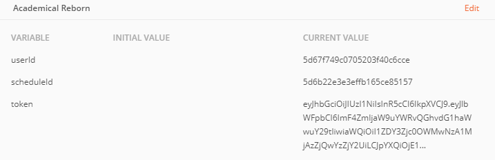

# Academical-reborn backend

This is the backend for the "Academical-reborn" web app.

## Description

The backend was built using a JS stack: Node JS with Express and MongoDB. Also, in order to get the cultural events from the university, we built a scrapper (found at the scrapper folder) that renders the HTML of the site, and copies the data into our Mongo database in a custom fashion (every x hours of everyday).

### Libs

- cors: Enable cors for all requests
- cheerio: Subset of core jQuery for selectig HTML data easily (scrapper)
- dotenv: Use of environmental variables in .env files
- express: Node web framework used for building the REST services.
- express-validator: Validator of body request structures for Express.
- jsonwebtoken: Generation of our own authentication tokens (jwt).
- mongodb: Driver for connecting with our Mongo database in Atlas.
- nodemon: Hot-reloading of the backend server.
- node-schedule: Chrono tasks for the scrapper.

### Folder Structure

- app: All app logic related components with a general routes file and a folder for each parent resource identified on the database. For each for these resources you have either more subresources with their respective routes.js file, or the following files:
  - controller: Receives all REST requests and delegates the results to querys.js.
  - querys: Communication with the MongoDB.
  - routes: RWST routes for communicating with the backend.
- readme: Images and other attachments used in this readme
- scrapper: Contains js files for scrappers to be ran over certain periods of time
- util: Common features for the app, including auth, db and errors management
- app.js: Main app connection

## Setup: Environmental variables

We are using environment variables in node throught a .env file. They are listed below:

### Token generation

- privateKey: Generated from http://travistidwell.com/blog/2013/09/06/an-online-rsa-public-and-private-key-generator/
- publicKey: Generated from http://travistidwell.com/blog/2013/09/06/an-online-rsa-public-and-private-key-generator/

Both of privateKey and publicKey are necessary to generate our own jwt tokens for sign up and log in operations.

### DB Connection

- dbUser: User for db connection
- dbPassword: Password for db connection
- dbHost: Host for db connection. Mongo atlas is recommeded for this step.

All these credentials are though out for a connection with a mongodb with SRV

### Scrapper general setup

- maxWeeks: Maximum number of weeks to look at
- hourInterval: Interval for starting the scrapper in hours
- timeStart: Hour for the start of schedules
- rangeMinutes: Minutes it should separate each time frame
- scrapper: Flag for dev purposes. If setup to anything other than 1 it will not run the scrapper.

## Setup: Run the app

Once the .env file is properly located in the backend folder with the above properties. Open a terminal on this the same folder and run:

```
npm install
```

When libs are installed, run the next command for making the server run in port 4000:

```
npm start
```

## Scrapper

The scrapper is run directly from app.js, and it runs every X amount of hours on the day (this is defined in the environment variables config) looking for a specific number of weeks ahead of the current date.

## Postman tests

For the tests there are two things to take into account:

- Perform login or register first through the endpoints
- Use the following environment: 
